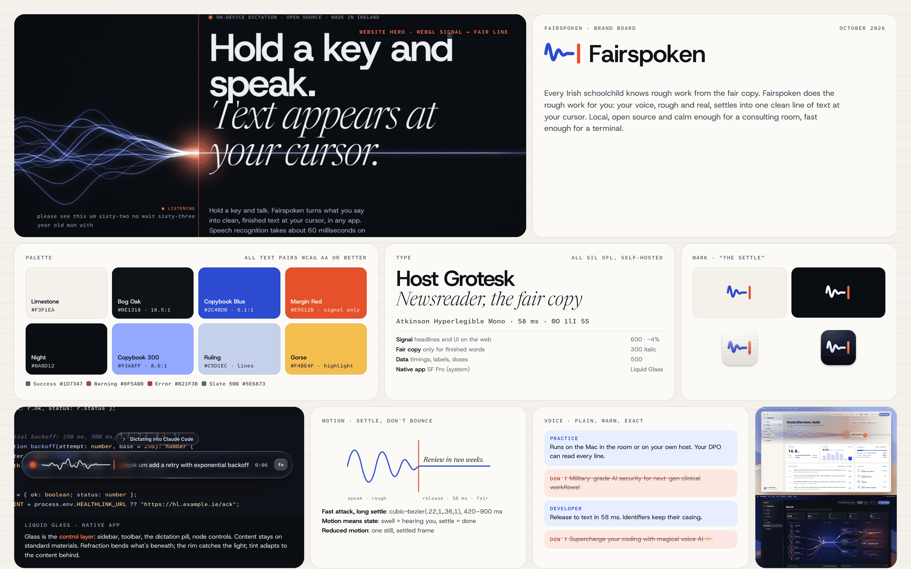
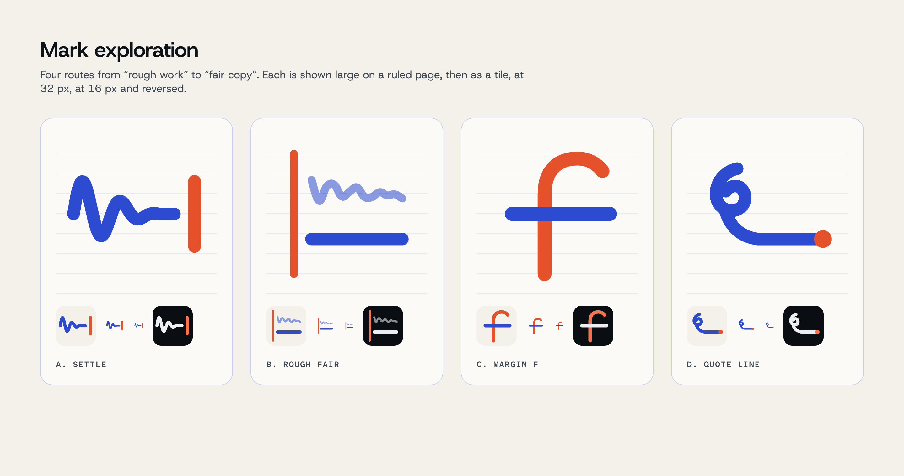

# Fairspoken brand identity

October 2026. Brand, website prototype and macOS 26 Liquid Glass mockups for **Fairspoken**: Irish, open-source, local-first push-to-talk dictation.



| | |
|---|---|
| **Mark** | "The Settle": a spoken wave settles into one straight line and stops at a red caret |
| **Palette** | Limestone, Bog Oak, Copybook Blue, and Margin Red for the signal only |
| **Type** | Host Grotesk (signal), Newsreader italic (fair copy), Atkinson Hyperlegible Mono (data). All SIL OFL, self-hosted, **nothing to buy** |
| **Website** | [`site/index.html`](site/index.html): raw WebGL2 hero, scroll story, light/dark, responsive, reduced motion |
| **App mockups** | [`app/index.html`](app/index.html): Home, dictation pill, Server, Models. Real refraction, Chromium only |
| **Research** | [`research/README.md`](research/README.md): 15 sites captured, plus the Liquid Glass study |

---

## 1. Concept and story

### Positioning
Fairspoken turns speech into clean, finished text in any app, on hardware you own. For developers it's the fastest way to talk to coding agents. For an Irish GP practice it's dictation that runs on the practice's own hardware.

| | Developer in Berlin | Practice manager in Cork |
|---|---|---|
| Wants | Speed, precision, hackability, no lock-in | Calm, safety, no new systems, an answer for the DPO |
| Proof we show | 58 ms tags, terminal demo, host protocol, MIT licence | Floor plan of the practice, referral letter, plain-English Q&A |

### The idea: rough work, then the fair copy
Every Irish schoolchild filled copybooks: the **rough work** in the margin or on the back page, then the **fair copy**, clean and final, written along the ruled lines in ink. That's exactly what the product does. You speak roughly, with ums, restarts and "no wait, I meant…", and Fairspoken writes the fair copy at your cursor.

The identity is built from three objects in that copybook:
- **The ruled line**, in Copybook Blue: where finished writing sits. It becomes the "fair line", the single clean signal.
- **The margin rule**, in Margin Red: the boundary between rough and fair. In the product it's also the **caret**, where your text appears.
- **The ink**: fair copy is set in a book serif (Newsreader italic); everything measured is set in mono.

The Irishness is carried by that shared memory, by Atlantic and limestone light in the palette (Burren limestone paper, bog-oak ink, gorse for highlights), by real Irish names and places spelled correctly (*Seán Ó Súilleabháin*, *Ní Bhriain*, *Dún Laoghaire*), and by "Made in Ireland" said once, plainly. **There are no shamrocks, Celtic knots, harps or green-washing.** Green appears only as a status colour.

The name works on both levels: *fair-spoken* means courteous and well-spoken; *fair copy* is the clean final draft.

### Taglines
None. Product and site copy stay plain and descriptive: say what it does, with real numbers.

### Voice and tone
Plain, warm, exact. Write like a good GP letter: short sentences, the facts first, no hype, no jargon the reader didn't bring. Use numbers when we have them, and never round them up. Use Irish/British spelling (*licence* as the noun, *optimise*, *colour*) and en-IE dates (*Sun 4 Oct*, *14/03/1962*).

| Context | Do | Don't |
|---|---|---|
| GP, privacy | "Runs on the Mac in the room or on your own host. Your DPO can read every line." | "Military-grade AI security for next-gen clinical workflows!" |
| GP, onboarding | "Hold fn, speak, let go. That's the whole interface." | "Unlock the power of AI-driven voice productivity." |
| GP, error | "The practice host isn't answering. Check it's switched on, then try again. Nothing was sent anywhere else." | "Oops! Something went wrong 😬" |
| GP, claim | "Add Ó Súilleabháin to your vocabulary and it's spelled right from then on." | "Understands every Irish accent perfectly." (unproven) |
| Developer, speed | "Release to text in 58 ms on the Neural Engine." | "Blazing-fast, lightning speed ⚡" |
| Developer, feature | "‘Deploy to prod, no wait, staging' arrives as `Deploy to staging`." | "Our magical AI understands what you really mean." |
| Developer, openness | "MIT. Read the host protocol, build your own client." | "Enterprise-ready platform with seamless integrations." |

Rules: no exclamation marks in product copy; no emoji in UI; never invent testimonials, logos or certifications; say "on this Mac" or "in the building", not "secure"; "polish" is the internal term, so customers see "clean-up" and "fair copy".

---

## 2. Logo

### Exploration


| Route | Idea | Verdict |
|---|---|---|
| **A. Settle** | A damped voice wave settling into one straight line, stopped by a red caret | **Chosen.** It reads at 16 px, says "voice becomes clean text at your cursor", and isn't a microphone, a set of bars or a medical cross |
| B. Rough / fair | A scribbled line above a clean one, beside a red margin rule | The best literal copybook, but it needs 32 px or more. **Kept as a brand pattern** (ruled page and margin) rather than the mark |
| C. Margin f | A monogram: the red margin rule as the stem, the blue ruled line as the crossbar | Handsome but generic, and the crossing lines start to read as a plus or cross, which is risky for health |
| D. Quote → line | A speech-mark curl that runs out into a line | Too calligraphic; muddy at small sizes |

Four amplitudes and frequencies of route A were then compared. The chosen one (2.25 cycles, 4.5-unit stroke) reads as a spoken phrase. Denser waves started to look like an ECG trace, which is the wrong signal for a GP product.

### Final files (`logo/`)
| File | Use |
|---|---|
| `fairspoken-lockup.svg` / `-reversed` / `-mono` / `-mono-reversed` | Primary lockup (mark plus wordmark, outlined) |
| `fairspoken-mark.svg` / `-reversed` / `-mono` / `-mono-reversed` | Mark alone, on a 64-unit grid |
| `fairspoken-wordmark.svg` / `-reversed` | Wordmark alone (Host Grotesk 600, −2.2% tracking, outlined) |
| `favicon.svg` (follows the browser's light/dark), `favicon-16/32/48.png`, `apple-touch-icon.png` | Web |
| `app-icon/layer-0-background(-dark).svg`, `layer-1-ruling.svg`, `layer-2-signal.svg`, `layer-3-caret.svg` | **Icon Composer layers** for the macOS 26 icon (background, middle, foreground) |
| `app-icon/app-icon-1024.png`, `app-icon-dark-1024.png`, `compose.html` | Preview composites with glass lighting. The shipping icon should be built in Icon Composer from the layers so the system applies the real material |
| `logo-sheet.png`, `exploration/` | Overview and exploration |

**Construction:** the caret is 24 units tall, and the wordmark's cap height equals the caret, sitting on the same baseline. The wave's centre line is the caret's midpoint. **Clear space:** one caret height on every side. **Minimum size:** lockup 96 px wide (20 mm in print); mark 16 px. **Colour:** wave in Copybook Blue (or white when reversed), caret always Margin Red unless the version is mono. Never recolour the caret blue, put the mark in a circle, or add a microphone.

---

## 3. Palette

Named after copybook objects and Irish landscape light. **Margin Red is the signal**: live microphone, the caret and the margin rule. It's never used for errors, which use a separate crimson and always carry an icon and a word.

| Name | Hex | Role |
|---|---|---|
| Limestone | `#F3F1EA` | Light background (Burren limestone paper) |
| Paper | `#FBFAF6` | Raised surfaces, cards |
| Bog Oak | `#0E1318` | Text, dark surfaces |
| Night | `#0A0D12` / Night 2 `#141922` | Dark background and surfaces |
| Copybook Blue | `#2C4BD0` (dark mode `#93A8FF`) | Primary actions, links, the fair line |
| Margin Red | `#E5512B` (text `#B23B16`; dark mode `#FF7148`) | The signal: margin, caret, live mic. Graphics and large text only at the base value |
| Ruling | `#C5D1EC` | Ruled lines, hairlines (decorative) |
| Gorse | `#F4BE4F` (text `#8F5A00`) | Highlight and warning |
| Slate 700 / 500 / 400 / 300 | `#3D4752` `#5E6873` `#8B95A2` `#B0B8C3` | Secondary and muted text |
| Success / Error | `#1D7347` / `#B21F3B` (dark mode `#5ED39A` / `#FF7A8F`) | Status only, always with an icon and a label |

**WCAG check** (`node _tools/contrast.mjs`). Every text pair reaches AA; the decorative ruling isn't text:

| Mode | Use | Colours | Ratio | Grade | Meets target |
|---|---|---|---|---|---|
| light | Body text: Bog Oak on Limestone | `#0E1318` on `#F3F1EA` | 16.52 : 1 | AAA | pass |
| light | Secondary text: Slate 700 on Limestone | `#3D4752` on `#F3F1EA` | 8.36 : 1 | AAA | pass |
| light | Muted text: Slate 500 on Limestone | `#5E6873` on `#F3F1EA` | 5.02 : 1 | AA | pass |
| light | Muted text: Slate 500 on Paper White | `#5E6873` on `#FBFAF6` | 5.43 : 1 | AA | pass |
| light | Link / primary: Copybook Blue on Limestone | `#2C4BD0` on `#F3F1EA` | 6.14 : 1 | AA | pass |
| light | Button label: white on Copybook Blue | `#FFFFFF` on `#2C4BD0` | 6.94 : 1 | AA | pass |
| light | Signal text: Margin Red 600 on Limestone | `#B23B16` on `#F3F1EA` | 5.26 : 1 | AA | pass |
| light | Margin Red (graphic) on Limestone | `#E5512B` on `#F3F1EA` | 3.35 : 1 | AA large / graphics | pass |
| light | Success on Limestone | `#1D7347` on `#F3F1EA` | 5.17 : 1 | AA | pass |
| light | Warning (Gorse 700) on Limestone | `#8F5A00` on `#F3F1EA` | 5.12 : 1 | AA | pass |
| light | Error on Limestone | `#B21F3B` on `#F3F1EA` | 5.89 : 1 | AA | pass |
| light | Ruling line (decorative) on Limestone | `#C5D1EC` on `#F3F1EA` | 1.36 : 1 | decorative only | pass |
| dark | Body text: Mist on Night | `#ECEEF1` on `#0A0D12` | 16.74 : 1 | AAA | pass |
| dark | Secondary text: Slate 300 on Night | `#B0B8C3` on `#0A0D12` | 9.72 : 1 | AAA | pass |
| dark | Muted text: Slate 400 on Night | `#8B95A2` on `#0A0D12` | 6.41 : 1 | AA | pass |
| dark | Muted text: Slate 400 on Night Surface | `#8B95A2` on `#141922` | 5.80 : 1 | AA | pass |
| dark | Link / primary: Copybook Blue 300 on Night | `#93A8FF` on `#0A0D12` | 8.60 : 1 | AAA | pass |
| dark | Button label: Night on Copybook Blue 300 | `#0A0D12` on `#93A8FF` | 8.60 : 1 | AAA | pass |
| dark | Signal: Margin Red 400 on Night | `#FF7148` on `#0A0D12` | 7.14 : 1 | AAA | pass |
| dark | Success on Night | `#5ED39A` on `#0A0D12` | 10.43 : 1 | AAA | pass |
| dark | Warning (Gorse 300) on Night | `#F4BE4F` on `#0A0D12` | 11.42 : 1 | AAA | pass |
| dark | Error on Night | `#FF7A8F` on `#0A0D12` | 7.81 : 1 | AAA | pass |

---

## 4. Typography

| Role | Family | Licence | Notes |
|---|---|---|---|
| **Signal** (display, UI and body on the web) | **Host Grotesk** (Element Type) | SIL OFL 1.1 | Variable 300–800. Headlines 600 at −4% tracking; body 400 at 17–18 px |
| **Fair copy** (finished words only) | **Newsreader** (Production Type) | SIL OFL 1.1 | Variable opsz 6–72 and weight 200–800, with italic. Use it **only** for text Fairspoken has produced or the one "fair copy" phrase in a headline. That rule is what separates us from the generic serif-italic trend |
| **Data** (timings, labels, code, doses) | **Atkinson Hyperlegible Mono** (Braille Institute) | SIL OFL 1.1 | `0/O`, `1/l/I` and `5/S` never collide, which matters for doses and dates |
| **Native app UI** | SF Pro (system) | Apple | Liquid Glass is designed around the system font. Brand faces appear only in the wordmark and, optionally, in transcript previews (Newsreader) |

- **Nothing needs buying.** All three faces are OFL and self-hosted (`site/fonts/`, licence files included). Fontsource builds were used; latin and latin-ext subsets cover Irish fadas (á é í ó ú) and other European languages.
- **Never load them from Google Fonts.** A Munich court ruled in 2022 that embedding Google Fonts leaked visitors' IP addresses in breach of GDPR. Self-hosting keeps the site free of third-party requests, which is part of the privacy story.
- *Optional paid upgrade, only if the founder wants a more exclusive voice later:* a commercial grotesk such as Söhne (Klim) or ABC Diatype (Dinamo) could replace Host Grotesk. Both are licensed per style and per usage; check current prices on the foundry sites. **It isn't needed.**

## 5. Iconography
- **Web:** custom line icons on a 24 px grid, 1.7 px stroke, round caps and joins, drawn in the site's SVG sprite. Weight matches Host Grotesk at 16–18 px.
- **Native app:** **SF Symbols** everywhere (`waveform`, `doc.text`, `server.rack`, `cube`, `lock`, `sparkle`). The mockups approximate them with the web set. Use the system's hierarchical rendering with Copybook Blue as the tint.
- No microphone in the logo. A microphone icon is fine as a control.

## 6. Imagery and illustration
- **Generative "signal portraits"** are the brand's only imagery: bundles of strands, rough on the left, converging at a red margin and leaving as one clean line, over soft colour fields and faint ruling. Each model, page or campaign gets a seed and a palette (brand, sea, ember, gorse, ink); see `Shell.signalArt` in `app/shell.js` and the hero shader in `site/hero-gl.js`. They make rich backgrounds for glass, are original, and need no licensing.
- **Product truth:** real UI, real copy, plausible data (Irish names, en-IE dates, real model names and benchmark numbers).
- **Documents:** the referral letter on ruled paper with a red margin is the GP-side hero image.
- **No stock photos of people**, no AI-generated faces, no glowing brains or robots.

## 7. Motion: settle, don't bounce
1. **Fast attack, long settle.** The ease is `cubic-bezier(.22, 1, .36, 1)` for reveals (420–900 ms) and `cubic-bezier(.4, 0, .2, 1)` for state changes (200–300 ms). No springs that overshoot.
2. **Motion means state.** Strands swell with syllables, which means *hearing you*. They settle to a line, which means *done*. A red spark at the margin means *your text is being written*. Nothing moves decoratively.
3. **Writing, not typing.** Fair copy is revealed left to right with a clip mask, like ink along a ruled line, not character by character.
4. **Scroll clears the rough work.** On the site the hero's margin slides left until it becomes the page's own margin rule, and the strands collapse into one line.
5. **Respect the room.** `prefers-reduced-motion` gives one settled still frame. Canvases render only while visible and stop when the tab is hidden; the hero runs at about 30 fps when the window isn't focused.

## 8. Liquid Glass rules for the native app
Distilled from Apple's guidance (see `research/README.md`) and tested in the mockups:

1. **Glass is the control layer, never the content.** Glass: the floating sidebar, toolbar groups, the dictation pill, the target chip, Server graph nodes (interactive, floating over a live canvas), and buttons and chips over artwork. Not glass: cards, lists, charts, the transcript, settings rows. Those use standard materials (`.background(.regularMaterial)` or opaque Paper/Night 2 cards).
2. **Choose the variant by what's behind and what's on top.** Use **Regular** for anything with text (sidebar, toolbar, the pill, nodes with labels). Use **Clear** only over rich imagery or icon-only controls, with a 35% dimming layer if what's behind is bright.
3. **Adapt to what's beneath, not to the system theme.** The pill over a dark editor is dark glass even in light mode, and over light practice software it's light glass (see `pill.html`).
4. **One prominent glass action per screen**, tinted Copybook Blue (`.buttonStyle(.glassProminent)` with `.tint`): *Dictate*, *Pair a device*, *Download*. Margin Red tint only for the live microphone.
5. **Concentric corners.** Window 26 pt, sidebar inset 10 pt so its radius is 16 pt, capsules fully rounded. Use `ConcentricRectangle` and `.rect(corners:isUniform:)`.
6. **Don't stack glass on glass.** Group related controls in one `GlassEffectContainer(spacing:)` so they merge and morph. Put solid buttons inside glass pills; don't nest glass.
7. **Let content run under the bars.** Hero art extends beneath the sidebar and toolbar (`.backgroundExtensionEffect()`), with `.scrollEdgeEffectStyle(.soft, for: .top)` under the toolbar.
8. **Accessibility:** under Reduce Transparency, glass becomes opaque (`--glass-tint-strong`). Text on glass must still meet 4.5 : 1 against the tint over the worst-case background, which is why labelled controls use Regular.
9. **Web and Tauri can't do this.** WKWebView and Safari ignore SVG filters in `backdrop-filter`, so the Tauri app should keep honest frosted materials and leave real refraction to the Swift app.

SwiftUI equivalents for the mockups: sidebar `NavigationSplitView` (automatic glass); toolbar `ToolbarItemGroup` with `.glassEffect()`; pill `.glassEffect(.regular.interactive(), in: .capsule)` in a non-activating `NSPanel`; Server nodes `.glassEffect(.regular, in: .rect(cornerRadius: 22))` inside one `GlassEffectContainer`.

---

## 9. Website prototype (`site/`)
Open `site/index.html` through any static server (font preloads need http; for example run `python3 -m http.server` in `design/brand`, then visit `/site/`). Query parameters: `?theme=light|dark`, `?t=3.2` (frozen hero frame for screenshots), `&script=0–3` (which dictation), `&all` (show every scroll reveal at once).

- **Hero:** a hand-written WebGL2 fragment shader (≈2 KB GLSL, one draw call, no library, no CDN). Sixteen strands carry a simulated voice (syllable-rate bursts) and converge at the red margin into the fair line. Copybook ruling sits on the fair side, the pointer excites the strands, and a live dictation loop runs rough words, then struck fillers, then fair copy written on the line, then a latency tag. Scrolling slides the margin into the page margin and collapses the strands. There's a static SVG fallback without WebGL2 and a still frame under reduced motion.
- **Sections:** how it works (scroll-pinned three steps with a practice/terminal toggle), speed (40–80 ms with a blink timeline), privacy (animated floor plan of a practice), the practice host (live request flow and log; vertical layout on phones), developers (terminal demo; *All signal. No noise.*), GP practices (referral letter and DPO Q&A), models, open source (the real host protocol), download.
- **Performance:** lazy start after fonts and idle; canvases render only on screen; DPR capped at 1.75; no third-party requests; about 550 KB of fonts. Light and dark themes with a toggle; the nav adapts to inverted bands; tested at 1440 and 390 px.

Screenshots (2×) in `site/screenshots/`: `hero-light/dark`, `hero-scroll-light`, `how-light/dark`, `speed-light`, `privacy-light/dark`, `host-light/dark`, `developers-light`, `practices-light/dark`, `models-light/dark`, `opensource-light`, `download-light/dark`, `mobile-hero-light/dark`, `mobile-host-dark`, `mobile-practices-light`, `reduced-motion-hero-light`.

## 10. Liquid Glass app mockups (`app/`)
Open `app/index.html` in Chrome. Screens are 1600 × 1000 desktops with an original generative wallpaper.

| Screen | File | Shows |
|---|---|---|
| Home | `dashboard.html` | Floating glass sidebar refracting the hero art; glass toolbar groups with prominent *Dictate*; clear glass dictation control sitting on the fair line (the line bends through its rim); standard-material cards for stats, recent dictations in Newsreader, and on-device status |
| Dictation pill | `pill.html?scene=dev` / `?scene=gp` | Regular glass pill over Cursor and Claude Code (live waveform, partial transcript, timer, fn), and the *Inserted* state over light practice software, lensing a BP chart; tint adapts to what's beneath |
| Server | `server.html` | Practice devices, host queue, workers and models as glass nodes over a live request-flow canvas (comets, bundles); metrics, latency chart, recent requests |
| Models | `models.html` | In-use model banner with glass chips and stats over generative art; library cards with glass actions over each model's own signal portrait; Hugging Face search |

Screenshots (2×, light and dark) in `app/screenshots/`. The pill is captured in both scenes and both system appearances.

**Information architecture** follows the existing concepts and the Swift app at `apps/macos/` (Home, Notes, Activity; Engine: Models, Server, Settings; the Server graph is devices → queue → workers → models, as in `HostGraphView`).

---

## 11. Decisions and purchases for the founder

**Nothing has to be bought for type or imagery.** Decisions and checks before launch:

1. **Domains:** availability of `fairspoken.com`, `fairspoken.ie` (needs an Irish connection, which you have) and `fairspoken.app` wasn't checked. Register `.ie` and `.com` at least. Also claim the GitHub organisation `fairspoken` (the repo is `sprintengine/fairspoken`) and social handles.
2. **Trademark:** run a clearance search for "Fairspoken" (EUIPO, IPOI and USPTO) before printing anything.
3. **No taglines.** The founder decided against slogans and taglines; product copy stays plain and descriptive.
4. **Claims to verify before publishing** (the site copy is written to be true as far as the repo shows, but these need sign-off):
   - "40–80 ms" is Parakeet on the Apple Neural Engine. The README for the Tauri/ONNX build says "a few hundred milliseconds". The site attributes the figure to the Mac and the Neural Engine only.
   - WER 2.27% / 4.12% (v3) and 2.13% / 3.81% (Ultra) are labelled LibriSpeech test-clean/other. Confirm the benchmark and its source.
   - Polish latency (the mockups show 184 ms as sample data) and whether SpeakoFlow Mini runs locally on all platforms.
   - **Fairspoken Cloud.** The README describes an optional paid cloud service with AI polish. The site describes local and host processing plainly; the optional cloud is off by default. Decide whether practices can lock it off, and say so.
   - History retention defaults ("kept 30 days" is mockup data), and whether audio is ever written to disk.
   - Whisper on the Mac app (shown in the Models mockup via Hugging Face) and Windows/Linux running locally versus through a host.
   - Healthlink, Socrates, Cursor and Claude Code are named as places text goes. That's fine descriptively, but avoid implying partnership.
5. **App icon:** build the final icon in Icon Composer from `logo/app-icon/layer-*.svg` and check the clear and tinted appearances.
6. **Optional:** commission a native Irish speaker to review any Irish-language copy before it's used. None is used now, deliberately.

## File map
```
design/brand/
├── README.md                 this brand book
├── board/brand-board.png     one-page summary (3840 × 2400); brand-board.html + assets/ source
├── research/                 README.md + 2× captures of 15 sites
├── logo/                     lockups, marks, wordmark, favicon, app-icon layers + previews, exploration/
├── site/                     index.html, site.css, site.js, hero-gl.js, fonts/ (OFL), screenshots/
├── app/                      index.html, dashboard/pill/server/models.html, glass.js, glass.css, app.css, shell.js, screenshots/
└── _tools/                   contrast.mjs, marks.mjs, gen-logo.mjs, gen-exploration.mjs, outline_text.py, shoot.mjs
```
The `_tools/` scripts need Node 22+, with Playwright and sharp installed outside the repo, and fontTools for `outline_text.py`. They're for regenerating assets, not for the product.
