# Home window: three redesign directions

October 2026. These are concepts for the main window (`home.html`, the Home screen) ahead of the open-source launch. The app is aimed at Irish GP practices as well as developers. Each direction is one standalone HTML file. Nothing in the app source was changed.

| Direction | Prototype | One line |
|---|---|---|
| **A. Clinical Calm** | [`clinical-calm/index.html`](clinical-calm/index.html) | Legible, calm and visibly private. Harbour teal on mist, with contour lines that "breathe". |
| **B. Signal** | [`signal/index.html`](signal/index.html) | A dark-first instrument panel. A silk waveform ribbon, monospace annotations and visible latency. |
| **C. Murmur** | [`murmur/index.html`](murmur/index.html) | Warm and editorial. Porcelain and terracotta, a particle bloom, stats written as sentences. |

**Recommendation: A (Clinical Calm), with two features borrowed from B.** See [Recommendation](#recommendation).

---

## How to view

Open any `index.html` directly. Fonts and three.js load from pinned jsDelivr URLs. Supported query parameters:

| Param | Effect |
|---|---|
| `?mode=light` / `?mode=dark` | Force an appearance. Otherwise it follows the system. The moon/sun button also toggles. |
| `?state=recording` | Open in the listening state. You can also click **Start dictation**, or **hold Space**, which stands in for `fn`. `Esc` cancels. |
| `?brand=Glinn` | Preview a name candidate. The name lives in one `BRAND_NAME` constant per file, and every `[data-brand]` element reads from it. |
| `?previews=hidden` | (A only) Start with dictation previews blurred. |
| `?idleFps=` / `?restMs=` | Change the idle frame rate (default 12 for A, 15 for B and C) and the rest timeout (default 10 s). Used for profiling. |
| press `p` | Show the frame-rate HUD (fps, frame cap, state, level). |
| `?capture` | Screenshot mode: ignores focus and uses a fixed time and level. |

The microphone level is simulated with a syllable-rate envelope (about 4.2 Hz bursts in 1.2–3.6 s phrases). It goes through **the same `meterLevelFromRms()` mapping that `src/main.ts` uses for the pill**: gate 0.004, full scale 0.026, square-root response.

Tools: `_tools/shot.mjs` is a dependency-free headless Chrome screenshotter that talks CDP over Node's built-in WebSocket. Its `--stub` flag fakes `window.__TAURI_INTERNALS__` so the real `home.html` renders under Vite. `_tools/cpu.sh` measures whole-Chrome CPU time.

---

## The current Home screen

| Light | Dark |
|---|---|
| 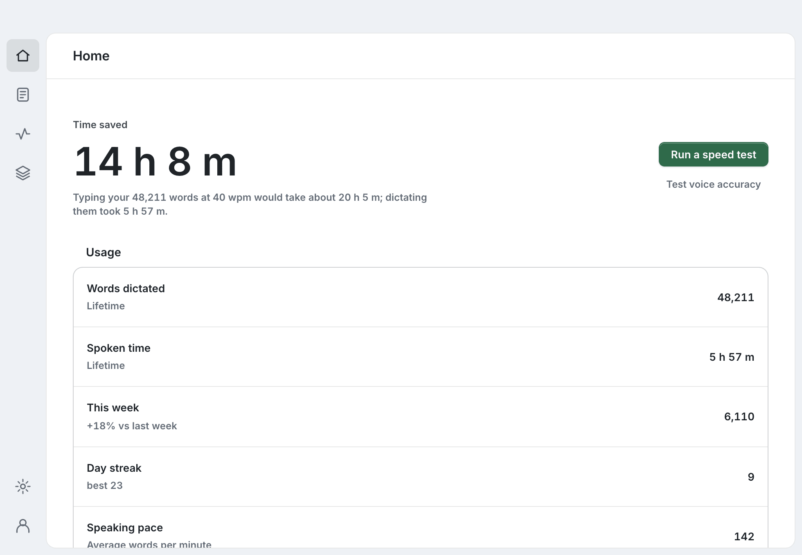 | 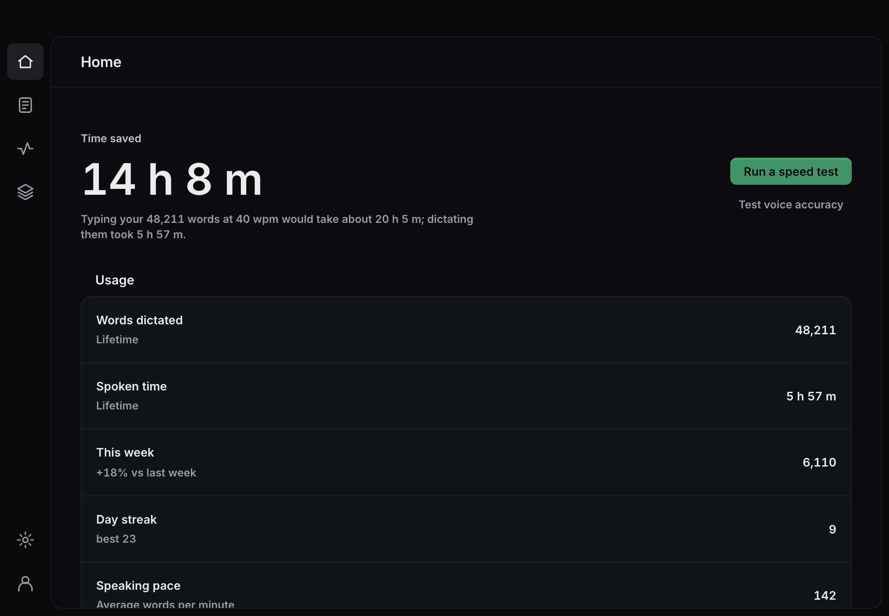 |

These were captured from the real `home.html` under `npm run dev` with stubbed Tauri data.

**What's good and should stay**
- The figures are honest. Time saved is measured against your real typing speed, and nothing is invented when there's no data.
- The token system (`src/design-system/tokens.css`) is disciplined. It has real light and dark modes, tabular numerals and AA contrast throughout.
- The native vibrancy (`underWindowBackground`) behind the chrome is cheap, and it's done correctly: one material, no stacked CSS blurs.
- The rail has tooltips, `aria-current` and visible focus. Reduced motion and reduced transparency are already respected.

**What's weak**
- **Stats are laid out like settings.** Seven full-width rows of equal weight, so a 680 px window shows the hero and about four rows. The weekly chart and the latency breakdown sit below the fold.
- **Nothing on Home says what's running or whether it's ready.** There's no model or host status, no microphone and no privacy statement. All of that is in Settings or Models.
- **There's no start-dictation control.** The primary button is *Run a speed test*, which is a secondary action. Nothing on screen teaches the `fn` gesture.
- **Recent dictations aren't on Home.** You have to go to Notes.
- **There's no brand presence.** The wordmark is effectively absent, and the green accent is generic.
- **The rail is icon-only.** That's fine for developers but a real cost for occasional clinical users.

Every direction keeps the same information architecture: Home, Notes, Activity and Models, with Settings and Profile below. Home now shows stats, recent dictations, model/host status and a start-dictation control in the first viewport.

---

## A. Clinical Calm

| Light | Dark (previews hidden) |
|---|---|
| 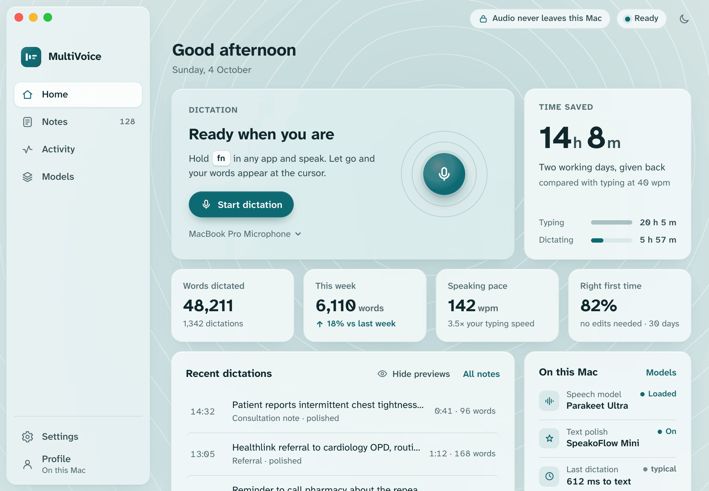 | 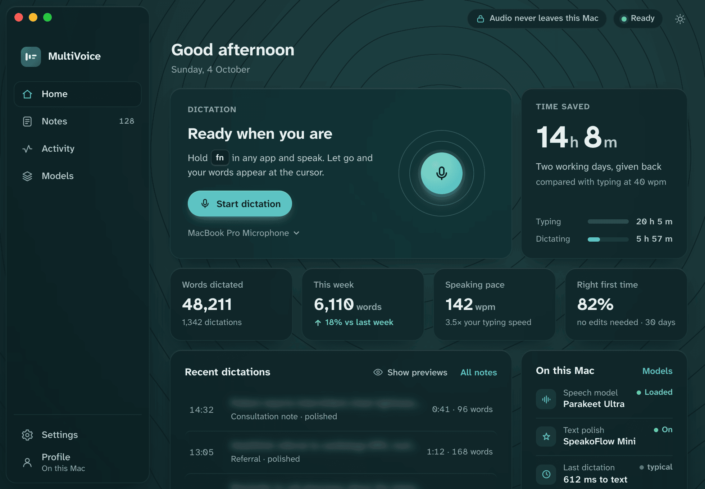 |
| 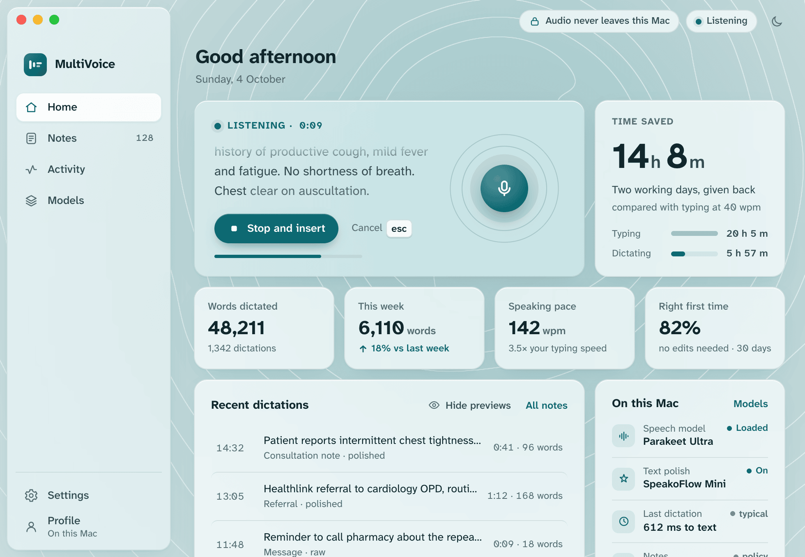 | 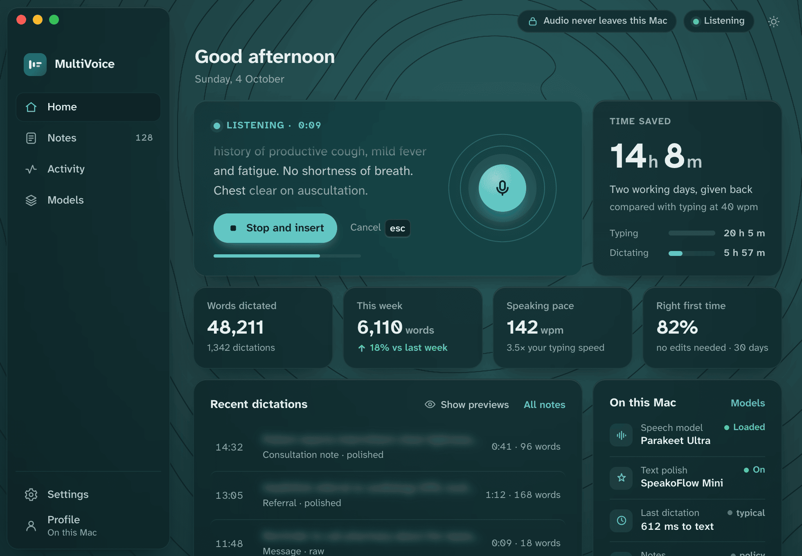 |

**Rationale.** A GP is dictating into a clinical system between patients, often while sharing a screen or with someone else in the room. The design priorities follow from that:
- Make the next action obvious: *Ready when you are. Hold `fn`.*
- Let users hide sensitive text instantly. **Hide previews** blurs every dictation preview, and hovering or focusing one row reveals just that row.
- State plainly what runs where: model, polish, latency, retention policy.

The sidebar has text labels, so nobody has to guess what an icon means. The sample copy is Irish: a Healthlink referral to cardiology OPD, a GMS patient, and `en-IE` dates. Mockup model names follow the current registry: polish is **SpeakoFlow Mini** in all three; A shows **Parakeet Ultra** as the speech model and B and C show Parakeet TDT 0.6B v3, so both names are tested in the layouts.

- **Logo mark, "voice becomes a line":** two vertical voice capsules that turn into two horizontal lines of text, in a teal squircle. It reads at 16 px and doesn't look like a medical cross or a microphone cliché.
- **Palette:** Harbour teal `#0b6874` on mist (`#e4eef0` → `#f4f6f2`); in dark, `#5cc3c3` on deep sea `#081114`. Green is used only for status (`Loaded`, `↑ 18%`), and always with a dot or arrow and a label.
- **Type:** **Atkinson Hyperlegible Next** and **Atkinson Hyperlegible Mono** (Braille Institute, SIL OFL). They were designed to keep characters distinct for low-vision readers, so `0/O`, `1/l/I` and `5/S` never collide. That matters when the text is a dose or a date. Both are self-hostable via `@fontsource-variable/atkinson-hyperlegible-next`.
- **Icons:** 1.7 px rounded stroke on a 24 px grid, soft-geometric, close to the current set so the migration is cheap.
- **Ambient, "isobar breath":** a single WebGL2 fragment shader draws slow topographic contours centred on the dictation orb. At idle they breathe at **6 breaths per minute** (a 10 s cycle, the resting-breath rate used in paced breathing). When you speak, ripples move outward from the orb, scaled by the live level. Raw WebGL is about 3 KB, and **three.js isn't needed for this direction**.
- **Motion:** slow and in one direction only. Ease-out for 420 ms on reveals, and no bounce. Nothing moves unless it means something: breathing means *ready*, ripples mean *hearing you*.
- **Glass:** the cards are frosted (22 px blur, saturate 1.35) over the contour field. The dictation stage is the most transparent card so the field reads through it. The sidebar uses a lighter "chrome" tint.

## B. Signal

| Dark | Light |
|---|---|
| 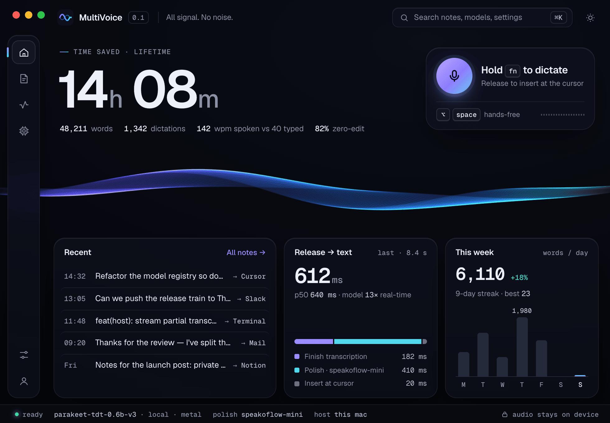 | 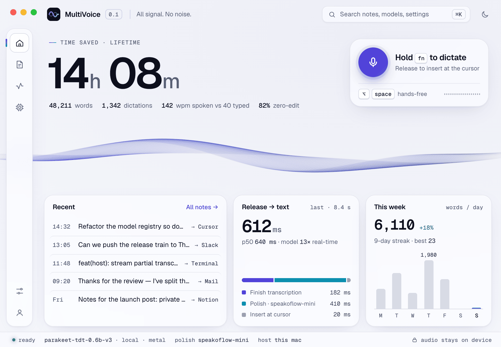 |
| 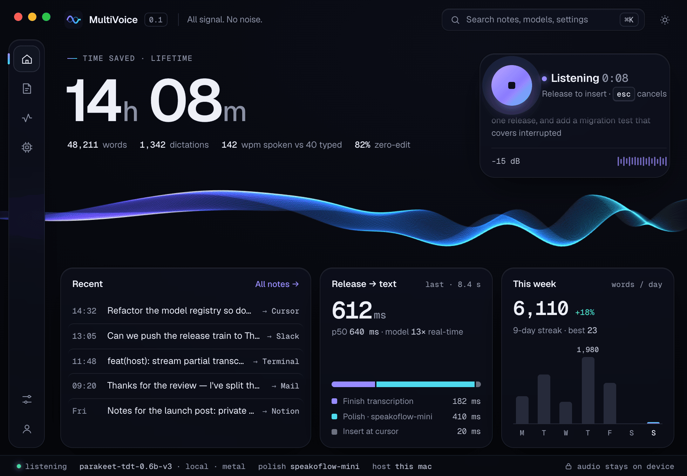 | 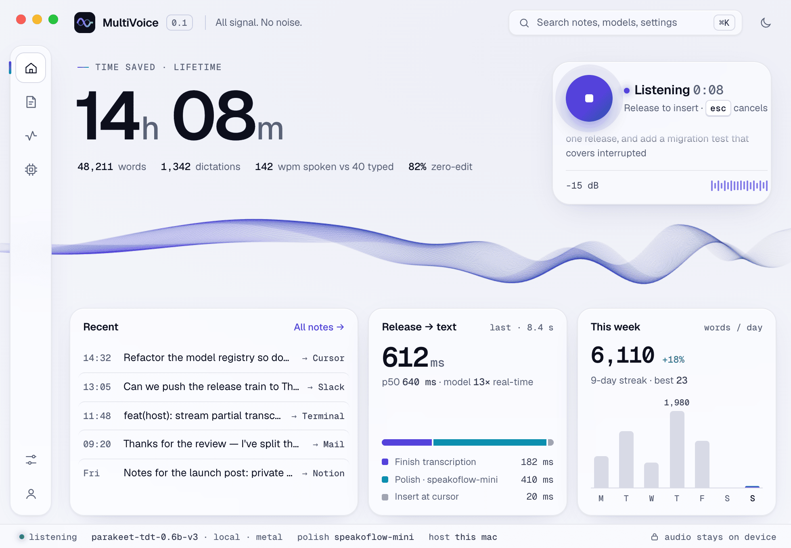 |

**Rationale.** This is for developers who choose tools by feel and by numbers. The window reads like an instrument:
- One giant figure (time saved) with a monospace sub-line of the other stats.
- A capsule for the push-to-talk gesture.
- A **Release → text** panel that breaks the last dictation's 612 ms into transcription, polish and insert, with a legend.
- An editor-style **status bar**: `parakeet-tdt-0.6b-v3 · local · metal`, `polish speakoflow-mini`, `host this mac`.
- Recent dictations show their destination app (`→ Cursor`, `→ Slack`, `→ Terminal`).
- A ⌘K command field.


- **Logo mark, "ribbon":** two phase-shifted waves crossing twice, which is the ribbon seen edge-on, in a violet → cyan gradient on an ink tile. This is the natural mark for a *Voicewave* name family.
- **Palette:** ink `#05060a`, violet `#9c8cff`, cyan `#4fd8ef`, signal green `#5be39a`. In light mode: paper `#f6f7fb`, indigo `#5a43e0` and teal `#0b8fb0`.
- **Type:** **Geist** and **Geist Mono** (Vercel, SIL OFL). The mono is used for every measured value, so numbers line up and read as data.
- **Icons:** 1.5 px stroke with square caps, precise. Models is drawn as a chip and Settings as sliders.
- **Ambient, "silk ribbon" (three.js):** 64 strands × 200 segments in **one `LineSegments` draw call**. The spine, twist and fan-out are all computed in the vertex shader, so each frame the CPU writes only three uniforms. Voice adds a travelling wave packet centred under the dictate capsule. Additive blending is used in dark mode and normal blending in light. The canvas sits **in its own band** between the hero figures and the panels and fades out at both edges, so no CSS-blurred glass is ever composited over moving pixels (see Performance).
- **Motion:** snappy (`cubic-bezier(.16,1,.3,1)`, 120–160 ms), with level meters that respond within one frame.

## C. Murmur

| Light | Dark |
|---|---|
| 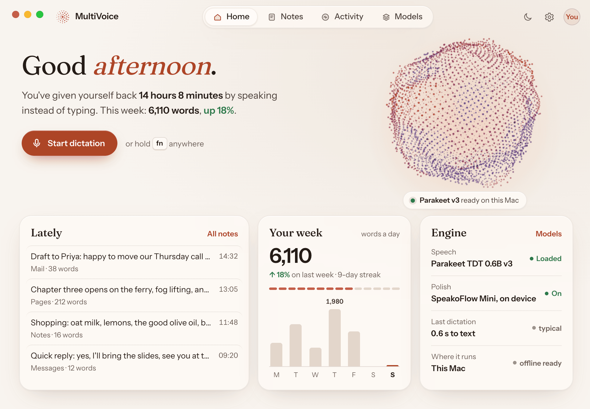 | 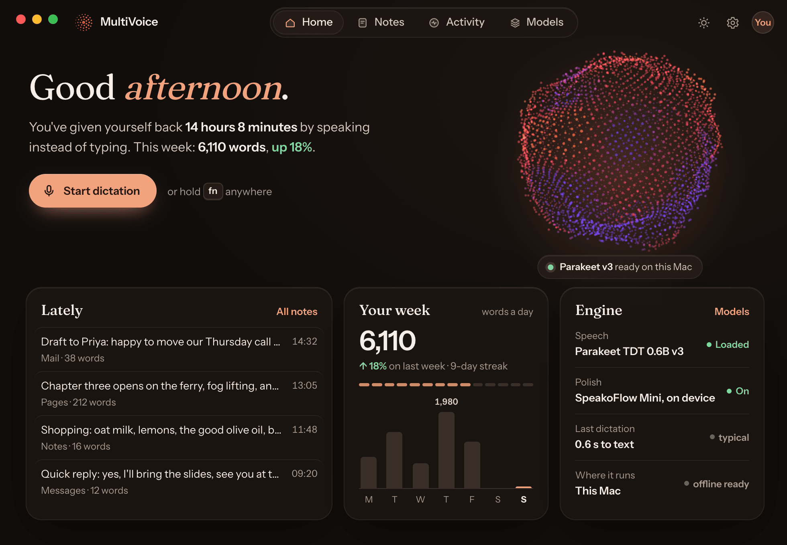 |
| 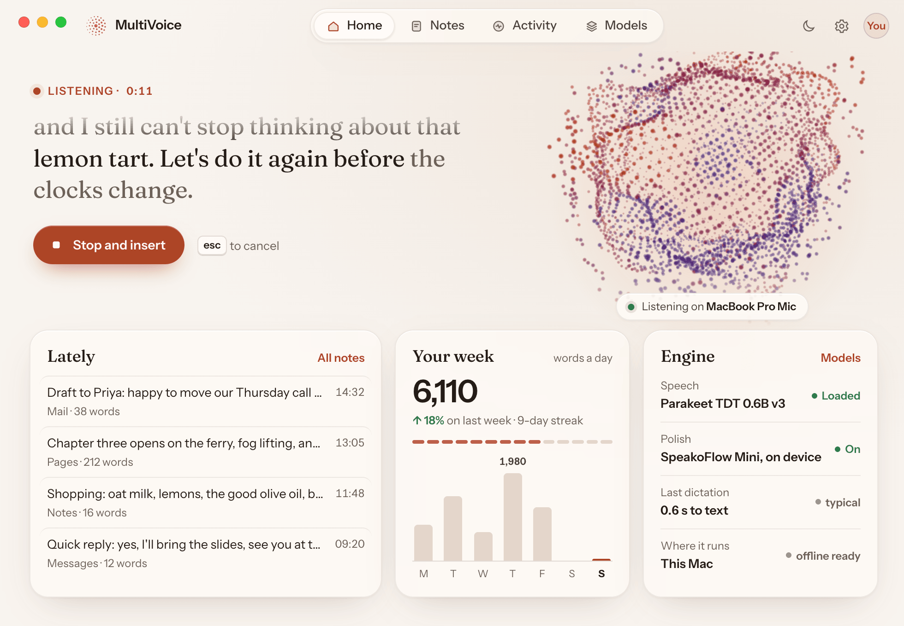 | 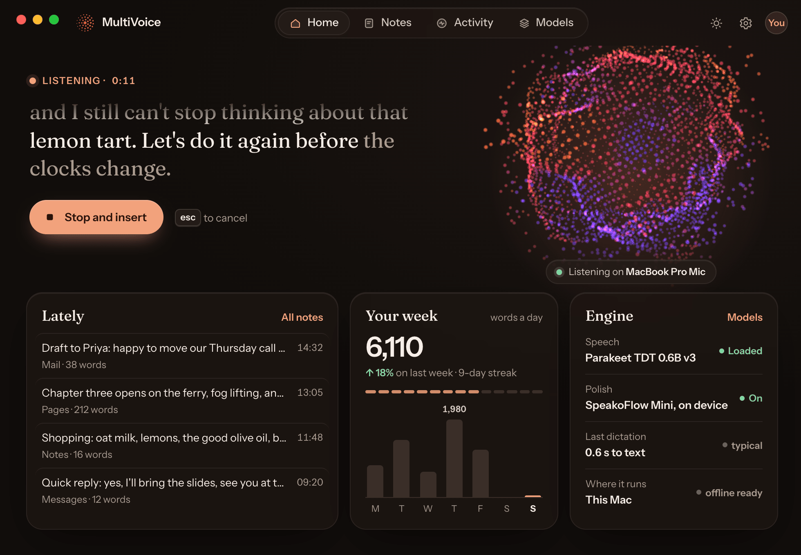 |

**Rationale.** This direction is personal and quietly luxurious, for people who write: letters, chapters, replies. The greeting is set in a serif and the stats are written as a sentence ("You've given yourself back **14 hours 8 minutes** by speaking instead of typing"). While you dictate, the live transcript is shown large in the serif. Navigation is a centred segmented control in the title bar, which leaves the full width for the hero.

- **Logo mark, "bloom":** three rings of dots radiating from a centre, growing toward the listener. It echoes the particle orb.
- **Palette:** porcelain `#f8f4ef`, terracotta `#ad4526` and a rose/lilac particle gradient. In dark mode: espresso `#110d0b` and apricot `#f2a27c`.
- **Type:** **Fraunces**, the variable serif with SOFT and WONK axes, for the greeting and card titles only. **Instrument Sans** is used for UI and **all figures**, following the rule that hero numbers stay in the UI sans. Both are SIL OFL.
- **Icons:** duotone, a 1.8 px stroke over a 14 % fill.
- **Ambient, "particle bloom" (three.js):** 3,600 points on a Fibonacci sphere, displaced by 3D noise in the vertex shader, in one `Points` draw call. At idle it breathes asymmetrically (4 s in, 6 s out). When you speak, the noise amplitude, radius and point size follow the level, and a latitude ring blooms outward on syllables. The canvas is local to the hero (460 px wide, not full-window) and stops, with a fade, before the cards.
- **Motion:** soft and slightly elastic (`cubic-bezier(.25,1,.3,1)`), with 160–260 ms transitions.

---

## Comparison

| | A. Clinical Calm | B. Signal | C. Murmur |
|---|---|---|---|
| Feel | Calm, legible, trustworthy | Precise, fast, a little electric | Warm, personal, editorial |
| Fit for an Irish GP practice | **Strong**: labelled nav, preview blur, privacy and retention always visible | Weak: dense and dark, with jargon | Medium: friendly, but the tone is consumer |
| Fit for developers | Good | **Strong** | Medium |
| First-viewport content | Start control, time saved, 4 tiles, recent, status | Hero, capsule, recent, latency, week, status bar | Greeting, start control, recent, week, engine |
| Navigation | Labelled sidebar (208 px) | Icon rail (52 px) and ⌘K | Segmented control in title bar |
| Ambient engine | Raw WebGL2 fragment shader, **≈3 KB** | three.js `LineSegments`, ≈121 KB gz | three.js `Points`, ≈121 KB gz |
| Glass over live pixels? | Yes, but only while dictating (30 fps) | No (canvas confined to a band) | No (canvas stops above the cards) |
| Display type | Atkinson Hyperlegible Next and Mono | Geist and Geist Mono | Fraunces and Instrument Sans |
| Muted-text contrast on glass (light / dark) | 5.4 : 1 / 6.9 : 1 | 5.9 : 1 / 6.2 : 1 | 5.5 : 1 / 6.8 : 1 |
| Primary button contrast | 6.5 : 1 / 7.9 : 1 | 6.3 : 1 / 7.1 : 1 | 5.5 : 1 / 8.6 : 1 |
| Name fit | *Glinn* (Irish for "clear, distinct"; confirm with a native speaker), *Fairspoken* | The *Voicewave* family | *Fairspoken* |
| Migration effort | Low to medium (closest to today's IA and icons) | Medium | Medium to high (new nav pattern) |

All three pass WCAG AA for body and muted text, computed against the glass colour composited over its backdrop. Status colours always come with a dot or arrow and a word. The charts are single-series: today's bar is in the accent, only the peak is labelled, every bar has a hover tooltip, and there's an `aria-label` summary for screen readers.

---

## Performance budget

Every direction uses the same scheduler, inlined in each file:

| Condition | Frame rate |
|---|---|
| Window hidden (`document.hidden`) | **0**: no rAF and no timers |
| Window blurred, not dictating | **0**: one still frame |
| Focused and idle, with input in the last 10 s | 12 fps (A) / 15 fps (B, C). Below 50 fps it **sleeps on `setTimeout`** instead of waking on every vsync. |
| Idle for more than 10 s ("rest") | **0**: still frame. Wakes on pointer, key, focus or visibility change. |
| Dictating | 30 fps (A) / 60 fps (B, C). Drops to 30 or 20 fps if the window isn't focused. |
| `prefers-reduced-motion` | One static frame. The level is shown only as a plain meter. |
| Canvas scrolled off-screen (C) | 0, via `IntersectionObserver` |
| `prefers-reduced-transparency` | Glass becomes an opaque surface |

Pixel ratio is capped at 1.5 (A, B) or 2 (C, which has a small canvas). Contexts use `powerPreference: "low-power"`, no depth or stencil buffers, and one draw call. All animation runs on the GPU; the CPU writes 3–4 uniforms per frame.

**Measured** with headless Chrome 154 on an Apple M4: ANGLE/Metal, 980×680 at 2× scale, cumulative CPU time of **all** Chrome processes (renderer, GPU and browser) over 10 s windows, shown as % of one core. Expect roughly ±2 points of noise.

| | Idle, looked at | Dictating | At rest (>10 s idle) | Reduced motion |
|---|---|---|---|---|
| A. Clinical Calm | 10.6 % (12 fps) | 13.3 % (30 fps) | 0.4–3.2 % | 0.6–1.9 % |
| B. Signal | 11.3 % (15 fps) | 27.7 % (60 fps) | 0.7–1.6 % | 1.7–2.3 % |
| C. Murmur | 10.3 % (15 fps) | 19.3 % (60 fps) | 1.7–2.5 % | still frame, same path as rest |
| *Reference: a 40 px CSS spinner at 60 fps* | *≈ 10 %* | | | |

Findings from the profiling, all of which changed the designs:
1. **Per-frame overhead dominates, not the shaders.** WebGL at 6 fps cost about 10 % and at 30 fps about 17 %. A trivial CSS spinner costs about 10 %. So the only way to stay under 3 % idle is to **not produce frames at rest**. That's why the ambient runs only while you're looking at the window (10 s after input), during dictation, and then settles to a still frame.
2. **`backdrop-filter` over moving pixels roughly doubles the cost.** Murmur went from 13.2 % to 6.6 % with blur disabled. The rule became *no live CSS blur over live pixels*: B and C confine their canvases to areas no glass covers. A accepts it only while dictating, at 30 fps.
3. **CSS keyframes inside a blurred card were worse than WebGL**: 23.7 % for two breathing rings. Avoid them, and drive the breathing from the same throttled loop instead.
4. Waking on every vsync just to skip frames is wasted work. Timer-based sleeping between frames is in all three files.

These are Chromium numbers. Treat them as relative and re-profile the shipped build in **WKWebView with Instruments** (Time Profiler and Core Animation) before calling the budget met. The structural guarantee doesn't depend on the engine: a menu-bar app's Home window is usually hidden or unfocused, and in both cases the scheduler produces **zero frames**.

---

## Recommendation

**Ship A. Clinical Calm**, the right default for an Irish GP practice and still pleasant for developers. Bring in two things from B:
1. **The *Release → text* breakdown** (transcription, polish, insert as a stacked bar with a legend) in A's "Last dictation" section. It's the most honest proof of the product's speed.
2. **An optional status line** (model, polish, host) at the bottom of the window, shown when a "Show technical details" preference is on. Developers get the instrument-panel feel and clinicians aren't burdened by it.

Why A:
- Its privacy affordances (hide previews, the on-device chip, the retention row) answer the first questions an Irish practice manager or DPO will ask.
- Its labelled navigation and Atkinson Hyperlegible type suit occasional and low-vision users.
- It is **the cheapest ambient**: 3 KB of raw WebGL and no three.js.
- It is the closest to today's IA and icon language, so the migration risk is lowest.

C's sentence-first summary ("You've given yourself back…") is worth testing as the empty-state and onboarding copy in A.

On naming: A's language (clear, calm, plain) pairs best with **Glinn** or **Fairspoken**. 

---

## Implementation plan (A in the Tauri app)

### Files

| File | Change |
|---|---|
| `src/design-system/tokens.css` | New Harbour palette and type tokens for light and dark. The header says it's generated from `foundations/tokens.tokens.json` by `scripts/build-tokens.mjs`, which **isn't in this repo**. Either update it upstream, or add `src/design-system/brand.css` loaded after `tokens.css` that overrides only the `--sem-*` values that change. |
| `package.json` | Add `@fontsource-variable/atkinson-hyperlegible-next` (and `-mono` for numerals). Drop `@fontsource/inter` once nothing imports it. Only latin subsets: about 40 KB of woff2 per axis set. |
| `home.html` | Rebuild `#screen-home`: stage card, time-saved card, tile row, recent dictations, "On this Mac" card. Keep the existing IDs that `homeStats.ts` writes to where the meaning is the same. Labelled sidebar items. One `<canvas id="ambient">` behind `.app`. Add a `[data-brand]` wordmark. |
| `src/dashboardShell.css`, `src/home.css` | 208 px labelled sidebar, glass card recipe, `prefers-reduced-transparency` fallback, and a 2×2 tile layout below 920 px (the window minimum is 860×560). |
| `src/homeStats.ts` | Render the tiles, the typing-vs-dictating comparison bars, and the week chart (single series, peak label, tooltips). Read the latency breakdown from `get_transcript_history` timings, which already exist. |
| `src/homeRecent.ts` (new) | Latest 4 notes via `get_notes`, plus the **Hide previews** toggle persisted in `localStorage` (default *on* when a "clinical" preference is set). |
| `src/homeSystem.ts` (new) | "On this Mac" card from `get_settings`, `get_dictation_models` and `get_transcription_model_status`. Refresh on `settings-updated`. Coordinate with whoever is editing the model registry (Parakeet Ultra, SpeakoFlow Mini) so the display names come from the registry, not hard-coded strings. |
| `src/ambient/field.ts` (new) | The WebGL2 isobar shader from the prototype (about 3 KB). Includes `setTheme()`, `resize()`, `render(t, level, breath)`, and `webglcontextlost` handling. |
| `src/ambient/scheduler.ts` (new) | The frame-budget scheduler (hidden / blurred / rest / dictating / reduced-motion), with timer-based sleeping between frames. |
| `src/audioLevel.ts` (new) | Move `METER_GATE_RMS`, `METER_FULL_RMS` and `meterLevelFromRms()` out of `src/main.ts` so the pill and Home share one mapping. |
| `src/main.ts` | Import from `audioLevel.ts`. No behaviour change. |
| `src/appearance.ts` | After `apply()`, dispatch `appearance-applied` so the field can recolour without polling. |
| `src-tauri/src/lib.rs` | Optional: a `dictation-state` event (`recording`, `transcribing`, `idle`). See below. |

### Wiring the live mic level

The backend already does almost everything:
- `audio.rs` computes a `LevelSample { peak, rms }` per capture callback (`chunk_level`).
- `start_audio_level_forwarder` in `lib.rs` takes the max over each 40 ms window, emits `audio-level` at about **25 Hz** with `app.emit`, and emits a final `{0, 0}` when capture stops.
- Because `app.emit` **broadcasts to every webview**, the Home window already receives these events. Today only the pill (`src/main.ts`) listens.

So on the Home side:

```ts
// src/homeAmbient.ts
import { listen } from "@tauri-apps/api/event";
import { meterLevelFromRms } from "./audioLevel";
let target = 0;
await listen<{ peak: number; rms: number }>("audio-level", ({ payload }) => {
  target = meterLevelFromRms(payload.rms);   // 0..1, perceptual
  scheduler.setDictating(true);               // wakes the loop if it was resting
});
// In the frame: level += (target - level) * (target > level ? 0.45 : 0.14);  (the pill's attack/decay)
```

Two small backend improvements are worth making:
1. **An explicit `dictation-state` event**, emitted where the pill already changes `appState` (start, release-to-transcribe, done or cancel). Without it, Home has to infer "recording" from levels arriving and "stopped" from the trailing zero. `transcript-session-started` and `transcript-history-updated` exist, but they don't cover cancel or error paths cleanly.
2. **Don't stream to a hidden Home window.** It costs little (25 small events a second while recording), but `start_audio_level_forwarder` could use `emit_to` with the pill label, plus `"home"` only when the home window `is_visible()`. Pair this with Tauri's `getCurrentWindow().onFocusChanged` in the scheduler, because a hidden WKWebView window doesn't reliably fire `visibilitychange`.

### three.js, if B or C is chosen

These were measured with esbuild against `three@0.170.0`, minified ESM:

| Import | Minified | gzip | brotli |
|---|---|---|---|
| `WebGLRenderer, Scene, PerspectiveCamera, BufferGeometry, BufferAttribute, LineSegments, ShaderMaterial` (B) | 479 KB | **121 KB** | 100 KB |
| Same set with `Points` (C) | 478 KB | 121 KB | 100 KB |
| `import * as THREE` | 687 KB | 177 KB | 145 KB |
| A's raw WebGL2 field | ≈3 KB | ≈1.3 KB | |

three.js doesn't tree-shake much below `WebGLRenderer`, which pulls in most of the core. In a Tauri app the cost is install size and about 10–20 ms of parse and compile at window open, not network. Load it with a dynamic `import("three")` after first paint and skip it entirely under reduced motion. Both B's ribbon and C's orb are a single shader and a single draw call, so porting them to raw WebGL2 like A is a day's work and removes the dependency.

### Rollout order
1. Tokens, fonts and the sidebar shell. Ship this behind no flag; it's a visual refresh.
2. Home layout and the new data cards (`homeRecent`, `homeSystem`, latency breakdown).
3. Ambient field and scheduler, behind an *Appearance → Ambient motion* toggle (On / Only while dictating / Off). Default: *Only while dictating* for clinical installs.
4. Profile in WKWebView with Instruments. Tune `IDLE_FPS` and `REST_AFTER_MS`, or drop idle motion entirely if it costs over 3 %.

---

## Translating to the native Swift app (macOS 26, Liquid Glass)

Liquid Glass is for the **navigation and control layer that floats above content**, not for content cards. Each direction keeps its identity natively by moving glass onto the controls and letting the content sit on standard surfaces.

| | A. Clinical Calm | B. Signal | C. Murmur |
|---|---|---|---|
| Window and nav | `NavigationSplitView`. The system sidebar gets Liquid Glass automatically, with labelled `Label` rows. | Compact sidebar (icon `Label`s, narrow column width), or a vertical `GlassEffectContainer` of glass buttons whose selection pill morphs using `glassEffectID`. | Segmented `Picker` in a `ToolbarItem(placement: .principal)`, which is glass in the Tahoe toolbar. No sidebar. |
| Primary action | Orb as `Button` with `.buttonStyle(.glassProminent)` and `.tint(.harbour)`. It morphs into *Stop and insert* inside a `GlassEffectContainer`. | Capsule as a `GlassEffectContainer`: mic button `.glassProminent` plus hint chips `.glassEffect(.regular, in: .capsule)`, which merge when recording. | `Start dictation` as `.buttonStyle(.glassProminent).tint(.terracotta)`. The *"Parakeet v3 ready"* caption uses `.glassEffect(.regular, in: .capsule)`. |
| Status and privacy | Toolbar items for *Ready*. They get glass automatically. | `.searchable` puts a glass search field in the toolbar (it replaces the ⌘K box). The status line is a `.safeAreaInset(edge: .bottom)` glass bar. | Settings and profile as toolbar items. |
| Content cards | Plain `.background(.background.secondary)` grouped surfaces, **not** glass. The field shows around them, not through them. | Same; dark-first via `.preferredColorScheme` only if the user opts in. | Same, in warm custom colours. |
| Ambient | Port the fragment shader to a Metal `[[stitchable]]` function used via `.colorEffect(ShaderLibrary.isobar(...))` on the detail background, driven by `TimelineView(.animation(minimumInterval: 1/12, paused: !isActive))`. | Metal vertex shader in an `MTKView` (`NSViewRepresentable`) with `preferredFramesPerSecond` and `isPaused` controlled by the same state machine. | Metal point-sprite shader in an `MTKView`. `SpriteKit` would also do, but Metal keeps it to one draw call. |
| Mic level | Read directly from the `AVAudioEngine` input tap (RMS per buffer) through an `@Observable` model. No IPC and no 25 Hz event throttling needed. | Same | Same |
| Pausing | `NSWindow.occlusionState` (more reliable than web visibility), `scenePhase`, `NSApplication.didResignActive`. `CADisplayLink` stops when occluded. | Same | Same |
| Accessibility | `accessibilityReduceMotion` gives one still frame. `accessibilityReduceTransparency` and *Increase contrast* are handled by Liquid Glass automatically, so don't fight them. | Same | Same |
| Fonts | Bundle Atkinson Hyperlegible Next (OFL) and register it via `ATSApplicationFontsPath`. SF Pro would also be acceptable natively. | Geist and Geist Mono bundled, or SF Pro and SF Mono for a fully native feel. | Fraunces and Instrument Sans bundled. |

Native can meet the performance budget more easily: `MTKView.isPaused` and occlusion state give a true zero-cost rest, and Metal avoids the web compositor's per-frame and `backdrop-filter` overhead measured above. Keep the same rule, though: glass sits above the ambient layer, but the ambient never animates *under* a large glass area when nothing is being dictated.

---

## Files

```
design/concepts/
├── README.md                     this document
├── current/                      screenshots of today's home.html (stubbed Tauri data)
├── clinical-calm/                index.html + home-{light,dark}.png + recording-{light,dark}.png
├── signal/                       index.html + screenshots
├── murmur/                       index.html + screenshots
└── _tools/
    ├── shot.mjs                  headless Chrome (CDP) screenshots, --stub for Tauri, --perf for main-thread busy
    └── cpu.sh                    whole-Chrome CPU % over 10 s for a URL
```

All typefaces are SIL OFL 1.1 and self-hostable through `@fontsource-variable/*`. three.js is MIT. Each prototype is a single HTML file. The only external requests are the pinned font CSS on jsDelivr (`@5.3.0`) and three.js (`three@0.170.0`, B and C only).
